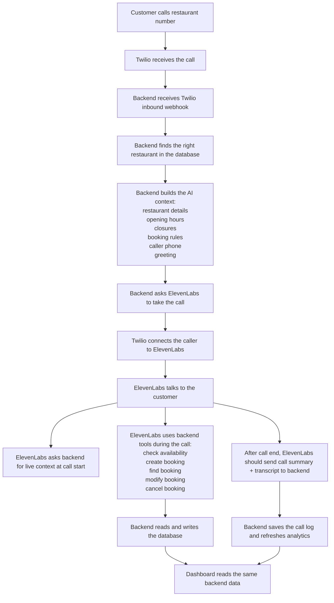

# App Interactions Flow

This is the simplest accurate explanation of how the app works today.

Use this to explain the system to non-technical teammates.

## What This Product Really Is

There are 5 moving parts:

1. `Caller`
   A customer calling the restaurant phone number.
2. `Twilio`
   The phone gateway. It receives the call first.
3. `Backend`
   The control center. It decides which restaurant this call belongs to, gives ElevenLabs the right context, saves bookings, and serves the dashboard.
4. `ElevenLabs`
   The AI voice agent that speaks with the caller.
5. `Database`
   The shared memory. Both the AI and the dashboard depend on the same restaurant, booking, and call data.

The dashboard is not a separate source of truth. It is a window into the same backend and database the AI uses.

## Simple Flowchart

## The Real Story In Plain English

### 1. A customer calls

The customer calls the restaurant phone number.

Twilio receives that call first.

Twilio then sends the call to the backend, not directly to ElevenLabs.

Why this matters:
- the backend is the traffic controller
- it decides which restaurant this call belongs to
- it gives ElevenLabs the correct restaurant data

### 2. The backend figures out which restaurant this is

The backend looks at the phone number that was called.

It checks the database and finds the matching restaurant record.

That restaurant record includes things like:
- restaurant name
- address
- timezone
- Twilio phone number
- ElevenLabs agent ID
- opening hours
- weekly closures
- special closed dates
- service shifts
- booking rules
- greeting text
- AI style notes
- escalation phone number

If the backend cannot match the call to a restaurant, it sends the call into a fallback flow instead of the normal AI flow.

### 3. The backend prepares the AI before the AI speaks

Before ElevenLabs starts talking, the backend builds a package of information for the AI.

This package includes:
- which restaurant this is
- the restaurant name and address
- today’s date and time in the restaurant’s timezone
- opening hours
- closed days and dates
- service shift summary
- party-size threshold for large groups
- the caller’s phone number
- the called restaurant number
- the Twilio call ID
- the AI style notes
- the greeting line

Important detail:
- the greeting can change by time of day
- for example, it can become “Buongiorno” earlier in the day and “Buonasera” later in the day

### 4. ElevenLabs takes over the live conversation

Once the backend has the right context ready, it asks ElevenLabs to take the call.

ElevenLabs returns the call instructions Twilio needs.

Twilio then connects the caller to ElevenLabs.

At that point, ElevenLabs becomes the voice the customer hears.

### 5. During the call, ElevenLabs keeps calling the backend

ElevenLabs does not make booking decisions on its own.

When it needs real facts, it asks the backend.

There are two main kinds of backend calls during the conversation:

1. `Context call`
What it asks for:
- restaurant details
- phone metadata
- greeting
- schedule context

Why:
- so the AI starts the conversation with the right restaurant identity and current context

2. `Booking tools`
What it can do:
- check availability
- create a booking
- find an existing booking
- modify a booking
- cancel a booking

Why:
- the AI speaks to the customer
- the backend makes the real decisions and updates the real data

## What The AI Gets From Each Place

### From the Database

The AI gets restaurant operating data through the backend, including:
- restaurant name
- address
- timezone
- opening hours
- weekly closed days
- one-off closed dates
- service shifts and max covers
- booking rules
- greeting text
- style notes
- escalation phone

The AI also indirectly uses live booking data through the backend when it:
- checks if a slot is available
- creates a booking
- finds a booking
- changes a booking
- cancels a booking

### From Twilio

The AI gets call-specific information through the backend, including:
- who is calling
- which restaurant number was called
- the Twilio call ID

This is how the system knows which restaurant context to load and which phone number belongs to the caller.

### From ElevenLabs

ElevenLabs is the conversation engine.

It contributes:
- the live voice conversation
- the decision to call tools when needed
- the post-call summary and transcript payload after the call ends

Important:
- ElevenLabs is not the final source of truth for bookings
- the backend and database are

### From the Frontend Dashboard

The frontend does not feed the AI during the call directly.

Instead, the frontend lets staff update the same restaurant settings and booking data the AI later uses.

That means:
- if the team changes opening hours, turni, greeting, or booking rules in the dashboard
- the backend saves that
- future AI calls use those updated settings

## What The Dashboard Actually Does

The dashboard is a browser app for owners and operators.

### Login and session

The browser:
- sends email and password to the backend
- receives a secure session cookie
- keeps using that cookie on future requests

### Restaurant selection

If the user is an owner:
- they usually work inside one restaurant

If the user is an operator:
- they can switch between restaurants
- the browser remembers the last selected restaurant

### Main screens

The dashboard asks the backend for:

- `Home`
  overview numbers and trends

- `Bookings`
  booking list, booking history, create/edit/cancel actions

- `Calls`
  call list, transcripts, outcomes, CSV export

Important detail:
- when someone opens the Calls screen, the backend also tries to pull recent conversations from ElevenLabs and backfill missing call records
- so call history is not coming only from the local database
- it can also be refreshed from ElevenLabs when the team opens that page

- `Capacity`
  covers used vs covers remaining per shift

- `Settings`
  restaurant identity, phone setup, greeting, AI style notes, opening hours, turni, booking rules

Important detail:
- this page changes the restaurant settings stored in the backend and database
- it does not fully configure the ElevenLabs agent itself
- voice model, LLM choice, and other advanced agent settings still live in the ElevenLabs console
- the backend only syncs a small part of ElevenLabs automatically right now, mainly restaurant name and tags

- `Admin`
  create restaurants, pause/reactivate restaurants, portfolio view for platform operator

## How Availability Is Decided

The backend decides availability when ElevenLabs or the dashboard asks for it.

The logic is:

1. Is the restaurant open that day?
2. Is that day blocked by a weekly closure or special closure date?
3. Is the party size allowed?
4. Is the request too soon or too far in advance?
5. Which service shift does that time belong to?
6. How many covers are already booked in that shift?
7. Is there still room?

If the answer is no, the backend can return alternative times.

Important:
- there is no pre-built slot table
- availability is calculated live from the rules and current bookings

## What Gets Saved In The Database

Main records involved in this flow:

- `restaurants`
  all restaurant setup and AI-related operating settings

- `bookings`
  the reservation itself

- `customers`
  a customer profile linked by phone

- `booking_events`
  the history of what changed in a booking

- `call_logs`
  the summary of a phone call, including outcome and transcript preview

- `users` and `user_restaurants`
  who can log in and which restaurants they can access

Important privacy note:
- customer names and phone numbers are encrypted in storage
- phone hashes are also stored for lookup

## What Is Configured Right Now

This is the current repo-documented setup as of `2026-03-29`.

### Live environment

- backend runs on Google Cloud Run
- dashboard runs on Google Cloud Run
- database is Supabase Postgres
- current public environment is live staging, not final production

### Twilio setup

Twilio should send inbound calls to:
- backend `/api/twilio/inbound`

Twilio fallback should point to:
- backend `/api/twilio/voice-fallback`

Twilio should not point directly to the old ElevenLabs URL.

### ElevenLabs setup

ElevenLabs currently handles:
- the live voice conversation
- the personalization request
- booking tool calls
- post-call webhook delivery

### Backend secrets and runtime settings that matter

The important live settings are:
- database URL
- JWT secret
- PII encryption key
- ElevenLabs API key
- ElevenLabs tool secret
- ElevenLabs personalization secret
- ElevenLabs webhook secret
- allowed frontend origins

### Frontend wiring

The dashboard calls `/api/...` routes.

In production, Next.js rewrites those requests to the backend using `NEXT_PUBLIC_API_BASE_URL`.

So the frontend appears simple in the browser, but it is really forwarding those API calls to the backend service.

## Important “Right Now” Caveats

These matter when explaining the current state to the team.

### 1. The main live call flow works

The working path is:

Twilio -> backend inbound route -> ElevenLabs -> backend tools -> database -> dashboard

This is the main supported path.

### 2. The after-call webhook is currently broken in live staging

The post-call webhook from ElevenLabs is currently auto-disabled in the live environment.

Why:
- the webhook signing secret in the live backend does not match the signing secret ElevenLabs is using

Effect:
- the live voice call can still happen
- bookings can still be created during the call
- but the automatic after-call summary/transcript saving path is currently not healthy in live staging until that secret is fixed and the webhook is re-enabled
- the dashboard partly compensates for this on the Calls page by asking ElevenLabs for recent conversations when that page is opened

### 3. Some newer improvements exist in code but are not fully live yet

The repo docs say some items are implemented locally but not yet deployed live, including:
- `call_status` support on call logs
- some greeting improvements
- tool-error outcome handling
- some debug and tool-health additions

So when explaining the product to the team, separate:
- what the codebase can do
- what the live staging deployment is actually doing today

### 4. Security is not fully finished

Known gaps include:
- Twilio inbound route currently does not validate Twilio’s signature
- the post-call webhook verification has already caused live failures because of secret mismatch
- operator access is broader than ideal

This does not change the core flow, but it matters when describing the maturity of the system.

## One-Sentence Summary For The Team

The phone call starts in Twilio, the backend identifies the restaurant and gives ElevenLabs the right context, ElevenLabs handles the conversation but asks the backend for all real booking actions, the backend updates the shared database, and the dashboard reads that same data so staff and AI stay in sync.
