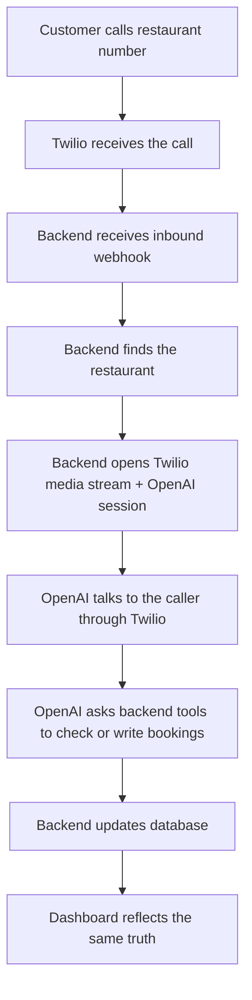

# App Interactions Flow

Last updated: `2026-04-10`

This is the simplest accurate explanation of how the app works now.

## What The Product Is

There are 5 moving parts:

1. `Caller`
   a customer calling the restaurant
2. `Twilio`
   the phone gateway
3. `Backend`
   the control center that owns the rules and tools
4. `OpenAI Realtime`
   the live voice model
5. `Database`
   the shared source of truth

The dashboard is not a separate system. It reads the same backend and database the phone agent uses.

## Simple Flow

## What The Backend Does

- identifies the restaurant
- builds the prompt and session config
- streams audio to and from OpenAI
- runs booking tools server-side
- keeps human transfer as a controlled fallback
- saves transcript preview, outcome, and tool events

## What OpenAI Realtime Does

- understands the caller
- speaks back in real time
- decides when to use the available tools
- follows the prompt and session rules the backend provided
- asks targeted clarification questions instead of transferring normal booking calls

## What The Studio Does

The operator can open `/studio` and:

- inspect the live prompt
- inspect the live session config
- test tools against the backend
- run text-mode simulations
- run a scenario-suite regression pass across the built-in presets
- save prompt and runtime settings for production use

This is how the agent is improved without editing code for every change.
