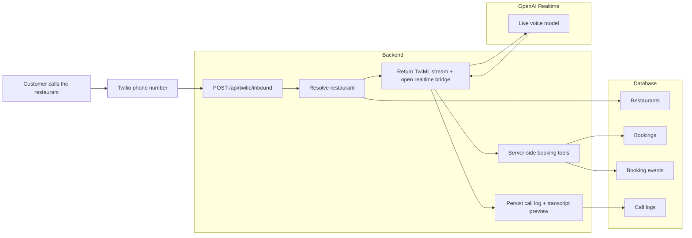

# App Interactions Visual Flow

Last updated: `2026-04-10`

## Plain-English Summary

- Twilio handles the phone number.
- The backend decides which restaurant the call belongs to.
- The backend streams the audio to OpenAI Realtime.
- OpenAI talks to the caller.
- Real booking work still happens in backend tools and the database.
- Transfer to the restaurant is a controlled fallback, not the default answer to unclear booking details.
- The dashboard reads the same booking and call data the phone agent produced.
- The studio gives operators a safe place to preview, test, and regression-check the live agent config.
