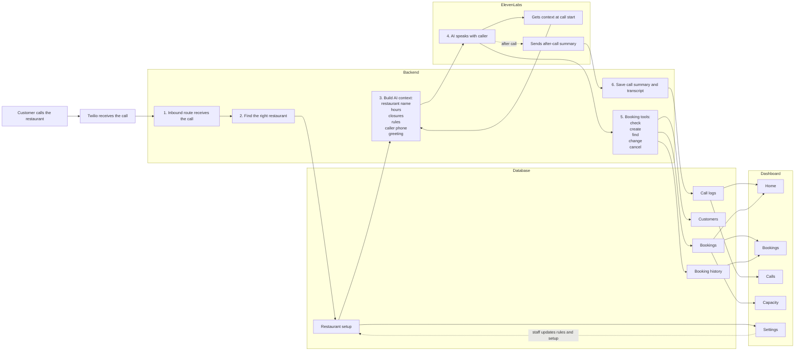
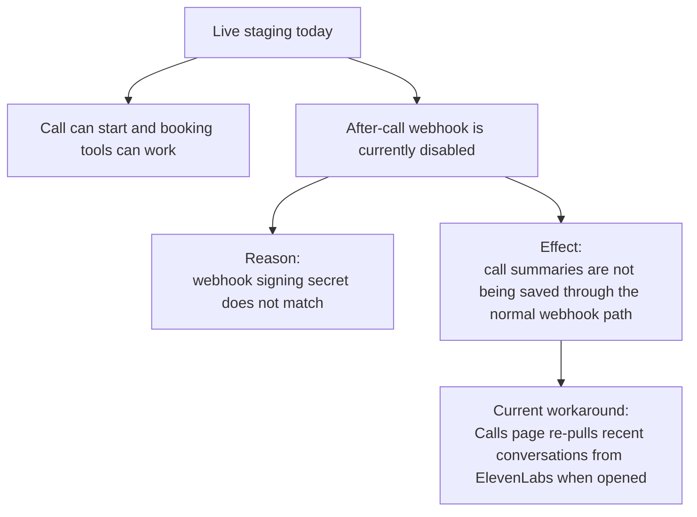

# App Interactions Visual Flow

This page is the visual version for team sharing.

## Main Flowchart

## One-Line Reading Guide

- Twilio starts the call.
- The backend identifies the restaurant and prepares the AI.
- ElevenLabs runs the conversation.
- During the call, ElevenLabs asks the backend to do real booking work.
- The backend reads and writes the database.
- The dashboard shows the same data the AI used.

## Current Live Caveat

