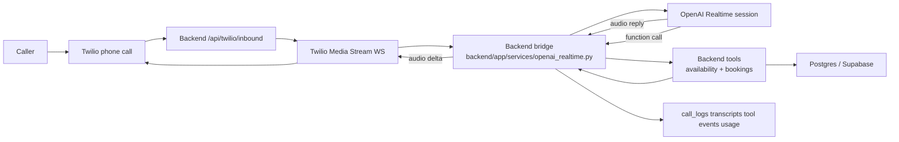

# OpenAI Realtime Readiness

Last updated: `2026-04-12`

This document contrasts the current app implementation with the current OpenAI Realtime guidance and highlights what is ready now versus what still depends on live credentials and real-call validation.

Primary references:

- [Realtime API](https://developers.openai.com/api/docs/guides/realtime)
- [Realtime conversations](https://developers.openai.com/api/docs/guides/realtime-conversations)
- [Using realtime models](https://developers.openai.com/api/docs/guides/realtime-models-prompting)
- [Server-side controls](https://developers.openai.com/api/docs/guides/realtime-server-controls)
- [Realtime transcription](https://developers.openai.com/api/docs/guides/realtime-transcription)

## Current Status

- codebase status: ready for deploy
- backend tests: passing
- dashboard production build: passing
- database migrations: passing locally
- missing for true live readiness:
  - `OPENAI_API_KEY`
  - deployed backend/domain with correct `PUBLIC_BASE_URL`
  - real Twilio inbound call verification

## Docs Contrast

| OpenAI recommendation | Current app implementation | Status | Notes |
| --- | --- | --- | --- |
| Use WebSocket for server-side Realtime agents. | Backend opens a server-side websocket to OpenAI from `backend/app/services/openai_realtime.py`. | Good | Matches the documented server-side path. |
| Keep tools and business logic on your server. | Booking tools are executed in backend code and write to the existing DB/services. | Good | This directly addresses the instability you had with the previous setup. |
| Use the GA Realtime session shape. | Session payload uses nested `audio.input` and `audio.output` config, including `audio/pcmu` for Twilio media streams. | Good | Matches the current direct WebSocket session payload used by the app. |
| Stream audio bytes from `response.audio.delta` for websocket audio output. | Twilio bridge consumes `response.audio.delta` and forwards it back to Twilio. | Good | This is the correct server-to-server audio flow. |
| Handle user interruptions by cancelling response and truncating audio. | The bridge listens for `input_audio_buffer.speech_started`, sends `response.cancel`, clears Twilio playback, and truncates the unplayed portion. | Good | Cancelling stops wasted token generation; truncate keeps conversation state consistent. |
| Keep volatile per-call context out of the static prompt prefix. | Date/time/caller context is injected as a runtime system message after `session.update`, not baked into the cached instructions. | Good | Preserves prompt-cache stability across calls. |
| Use closed tool schemas and disable parallel tool calls for write-sensitive flows. | Realtime tool schemas set `additionalProperties: false` and the session payload sets `parallel_tool_calls: false`. | Good | `strict: true` is intentionally not sent in Realtime `session.tools`; the live API rejects it as an unknown parameter. |
| Limit visible tools by phase. | Live calls start read-only and unlock write tools only after explicit confirmation is detected. | Good | Shrinks tool ambiguity before the caller says yes. |
| Guard against assistant audio feeding back into input. | The bridge now mutes forwarded caller packets while assistant audio is actively streaming. | Good | Prevents self-hearing loops in noisy telephony conditions. |
| Add a human escape hatch outside the AI flow. | Mid-call DTMF `1` transfers to the restaurant inside the Twilio media stream, and bridge failures attempt a live transfer. | Good | Keep inbound TwiML streaming immediately; a pre-stream `<Gather>` can prevent Twilio from opening the WebSocket. |
| Detect silent audio responses and retry once. | A watchdog cancels/retries responses that start but never emit assistant audio. | Good | Mitigates silent-response failure cases without waiting for caller abandonment. |
| Use explicit prompt sections, language pinning, tool preambles, escalation rules, and variety instructions. | Generated prompt has labeled sections plus prompt diagnostics in `/studio`. | Good | The prompt now treats human transfer as a last resort and rejects garbled audio fragments as booking data. |
| Use server-side controls / sideband patterns for guardrails and tool calls. | The backend bridge itself is the control plane and the tool executor. | Good | Twilio is the media client, backend is the governor. |
| Use tracing and truncation deliberately for production visibility and cost control. | Tracing and retention-ratio truncation are exposed in saved runtime config and shown in the studio. | Good | Defaults are present and adjustable. |
| Do not expect voice changes to apply mid-session after audio has started. | Voice is treated as a per-new-call config and the studio warns about this. | Good | Important operational note for tuning. |
| Realtime sessions are stateful and should be monitored operationally. | Calls persist `provider_call_id`, transcripts, tool events, usage, and failures into `call_logs.extra_data`. | Good | This improves debugging versus the previous architecture. |
| Test prompt and tool behavior iteratively because small wording changes matter. | `/studio` supports prompt preview, save/reset, tool sandbox, scenario presets, and text-mode simulation. | Good | This is now the main operator control surface. |

## Important Nuance

The current app uses response-level `output_modalities` for `response.create`, while the session payload keeps audio configuration under `audio.input` and `audio.output`.

Prompt/config changes should be verified in `/studio` and with a real Twilio call because voice-agent behavior is sensitive to small wording and VAD changes.

## How Realtime Actually Works

Plain-English version:

- Twilio carries the phone audio.
- Our backend opens a live WebSocket session to OpenAI Realtime.
- OpenAI listens to the caller audio and answers with generated audio in real time.
- When the model decides it needs restaurant data or needs to write a booking, it does not touch the database directly. It asks our backend to run one of our tools.
- Our backend executes the tool, returns the result to the model, and the model keeps speaking.

Important distinction:

- Realtime voice conversation is already live voice-to-voice.
- The separate `audio.input.transcription` block is optional. It is not what makes the call feel live.
- We keep it enabled because it gives us cleaner caller transcripts, better debugging, better call review, and more reliable confirmation/name handling.

Current repo choice:

- keep speech-to-speech Realtime enabled for the live conversation
- keep asynchronous input transcription enabled for observability and transcript quality
- keep tool execution on our server, not inside the model

Why this is correct for this product:

- a phone receptionist needs low latency voice replies
- we also need auditable transcripts and post-call review
- we need backend-owned booking writes and guardrails

## Current Flow



## Why We Keep A Transcription Model

OpenAI's current Realtime docs say `audio.input.transcription` is optional asynchronous transcription of input audio, while the speech-to-speech path itself is separate. In practice for this app that means:

- without transcription, the caller can still speak and the model can still answer live
- with transcription, we also get text events that help us:
  - log what the caller said
  - inspect bad calls later
  - detect clearer yes/no confirmations
  - spot name/date/time mistakes faster

So the transcription model is not the live voice engine. It is the visibility and reliability layer around the live voice engine.

## Config Review

The runtime payload shape remains aligned with the current GA Realtime docs:

- `type: realtime`
- `audio.input.format: audio/pcmu`
- `audio.output.format: audio/pcmu`
- `audio.input.turn_detection: server_vad`
- `audio.input.noise_reduction`
- `audio.input.transcription` enabled but without forced language by default
- `session.tools` with closed JSON Schemas
- `parallel_tool_calls: false`

Changes applied in code on `2026-04-12`:

- promoted the existing `balanced` phone preset into the default live baseline for restaurants without saved overrides
- default noise reduction is now `far_field`
- default `server_vad.threshold` is now `0.58`
- default `server_vad.silence_duration_ms` is now `900`
- default `server_vad.idle_timeout_ms` is now `7000`
- default truncation retention ratio is now `0.75`

Why these defaults are safer:

- OpenAI documents that higher `server_vad.threshold` can perform better in noisy environments
- noise reduction runs before VAD and turn detection, so it helps avoid false starts
- a slightly longer silence window reduces premature turn cuts on real phone calls
- a slightly longer idle timeout helps recovery on weak or choppy lines
- stronger truncation control reduces drift and cost on longer calls

What we intentionally did not change:

- no Studio UI changes
- no tool schema changes
- no change to the write-confirmation guard
- no change to read-vs-write tool gating

## Runtime Contract In This Repo

### Twilio

- `POST /api/twilio/inbound`
- `WS /api/twilio/media-stream`
- `POST /api/twilio/status`
- `POST /api/twilio/voice-fallback`

### OpenAI bridge

- session config and prompt assembly:
  - `backend/app/services/openai_realtime.py`
- tool execution:
  - same backend booking engine and DB logic as the dashboard

### Operator controls

- dashboard page:
  - `/studio`
- backend endpoints:
  - `GET /api/studio/agent`
- `POST /api/studio/tool-test`
- `POST /api/studio/simulate`
- `POST /api/studio/simulate-suite`
- `PUT /api/studio/config`
- `DELETE /api/studio/config`

## What Is Ready Now

- database-backed live prompt overrides
- database-backed per-restaurant Realtime tuning
- Twilio stream bootstrap without query-string auth
- OpenAI Realtime websocket bridge
- server-side tool calling with write-confirmation guardrails
- `gpt-4o-transcribe-latest` for input transcription by default
- prompt rules for full-name preservation, garbled-audio recovery, and last-resort human transfer
- transcript/tool-event persistence
- operator studio for tuning and testing
- docs and env examples updated for the OpenAI runtime

## What Still Needs Real-World Validation

- a real Twilio inbound call after deploy
- human transfer path with real Twilio credentials and `escalation_phone`
- OpenAI account limits, billing, and trace visibility in your actual project
- end-to-end call quality under noisy PSTN conditions

## Recommended Pre-Deploy Checks

```bash
cd backend
uv run ruff check app tests
uv run pytest
DATABASE_URL='<real-db-url>' uv run alembic upgrade head

cd dashboard
npm run build
```

Then, after deploy but before real traffic:

1. open `/studio`
2. confirm readiness checks are green enough for the target restaurant
3. run a real tool sandbox call
4. run a real text simulation
5. place a real Twilio phone call
